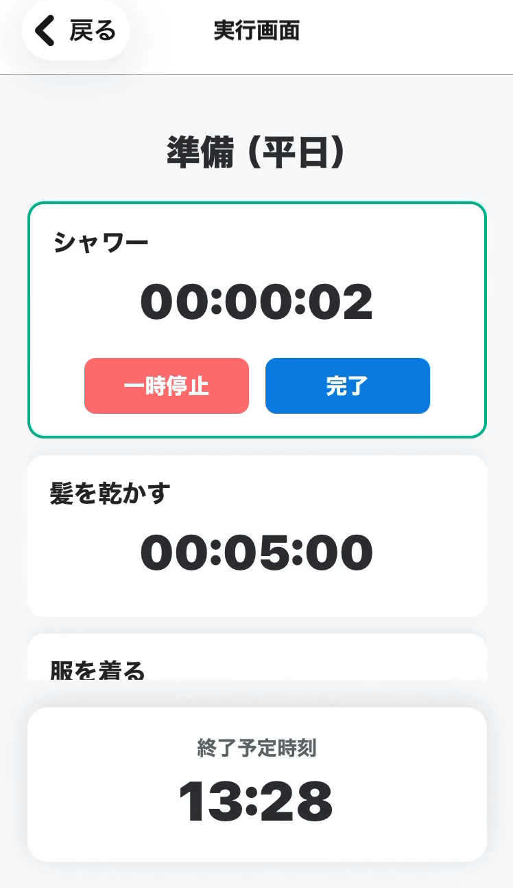
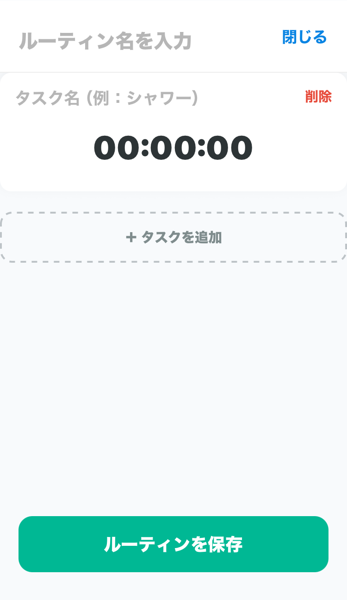
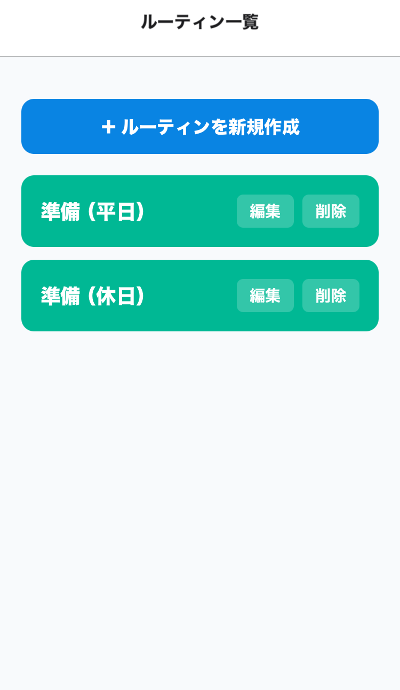

# ASD支援 逆算タイマー  
発達障害の方が抱える「時間の概念の捉えにくさ」や「過集中による切り替えの難しさ」をサポートするアプリです。 タスク全体を視覚的に示すことで、見通しの不安を解消します。

  

 

| タスク編集画面 | ルーティンリスト |
| :---: | :---: |
|  |  |
## 使用技術
* React Native (expo)
* TypeScript
> 技術選定理由  
* ReactNative: 外出先でも即座に使用できるよう、WEBアプリではなく、通知機能や直感的なUI操作に優れたモバイルアプリを選択しました。
* TypeScript:タイマーロジックやタスクの型を定義することで、保守性の高いコードを書く習慣をつけるため採用しました。

## 学んだこと
* 要件定義や設計思想など、上流工程という概念があること。
* 「MVP開発」「関心の分離」を意識したファイル構成の実践。
## 今後の展望  
現在はコア機能であるタイマーに集中して作成しましたが、以下のような発展の可能性を考えています。
* 自閉傾向の強い方にも対応できるよう、任意の動画やイラストなどを設定できる仕様。
* 様々な発達特性のケースが存在するため、保護者による個別カスタマイズが可能なバージョンの作成。
